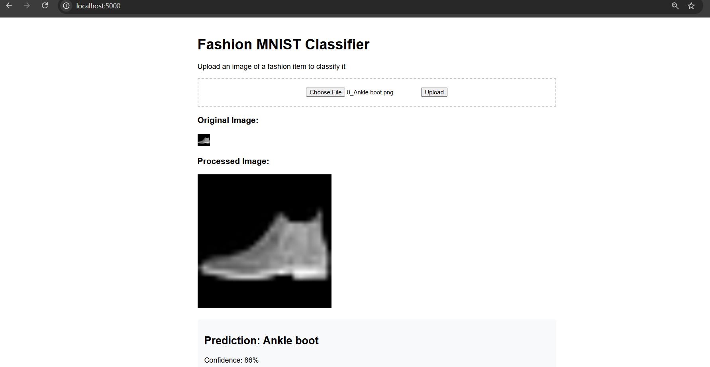
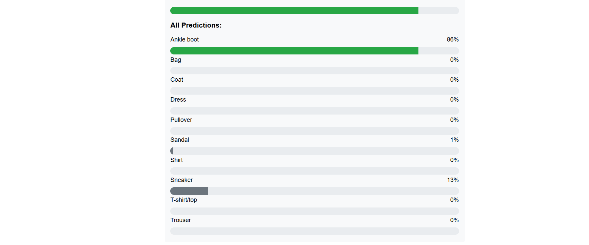

#  Fashion Image Classification Web App with TensorFlow & Hugging Face

This repository contains a Flask-based web application for classifying grayscale fashion images (e.g., from the Fashion MNIST dataset). The app supports image uploads, processes them using custom deep learning pipelines, and returns class predictions along with confidence scores.

---

## 🧠 Model Overview

- **Primary Model**: `InceptionV3` pretrained on ImageNet (via TensorFlow Keras)
- **Alternative Model**: `ResNet-50` from Hugging Face (`microsoft/resnet-50`)
- **Custom Layers**: Both models utilize wrapper layers to perform grayscale-to-RGB conversion, resizing, and feature extraction.
- **Custom Architectures**:
  - `InceptionV3FeatureExtractor`: Scales 28×28 grayscale images to 299×299 RGB and uses Inception's convolutional base.
  - `ResNetFeatureExtractor`: Wraps the Hugging Face ResNet backbone using `TFResNetModel` and processes inputs in `[batch, 3, 224, 224]` format.

> After comparative training and evaluation, **InceptionV3** yielded higher accuracy and generalization on Fashion MNIST grayscale images compared to Hugging Face ResNet-50.

---

## 🚀 Features

- Upload grayscale `.png`, `.jpg`, or `.jpeg` images
- Automatic resizing and RGB conversion
- View both original and preprocessed images
- JSON output containing:
  - Predicted class
  - Confidence score
  - All class probabilities

---

## 🧰 Tech Stack

| Component        | Technology                        |
|------------------|-----------------------------------|
| Web Framework    | Flask                             |
| Deep Learning    | TensorFlow (Keras API), Hugging Face Transformers |
| Pretrained Model | InceptionV3 (TF Hub), ResNet-50 (Hugging Face) |
| UI Template      | CSS + HTML                     |
| Image Processing | Pillow, TensorFlow                |


## 📂 Project Structure

```
.
├── app.py                      # Main Flask app
├── artifacts/
│   ├── fashion_mnist_inception.h5  # Trained model
│   └── class_names.json           # List of class names
├── static/
│   ├── uploads/                 # Stores original uploaded images
│   └── processed/               # Stores preprocessed images
├── templates/
│   └── index.html              # Main HTML template
└── README.md
```

---

## ⚙️ Setup Instructions

### 1. Clone the repository

```bash
git clone https://github.com/your-username/fashion-mnist-flask-app.git
cd fashion-mnist-flask-app
```

### 2. Create and activate a virtual environment

```bash
python -m venv venv
source venv/bin/activate  # or `venv\Scripts\activate` on Windows
```

### 3. Install dependencies

```bash
pip install -r requirements.txt
```

> Note: Ensure you have TensorFlow 2.x and `transformers` installed.

### 4. Run the app

```bash
python app.py
```

Navigate to `http://localhost:5000` in your browser.


## 🛠 Requirements

- Python 3.7+
- Flask
- TensorFlow
- Pillow
- Transformers
- NumPy

Recommended `requirements.txt`:

```txt
Flask
tensorflow
Pillow
transformers
numpy
```

---


## 📸 Sample UI

> 
<p align="center">
  
</p>
<p align="center">
  
</p>

---


## 🙋‍♂️ Author

Syed Wasif Murtaza Jafri

---

